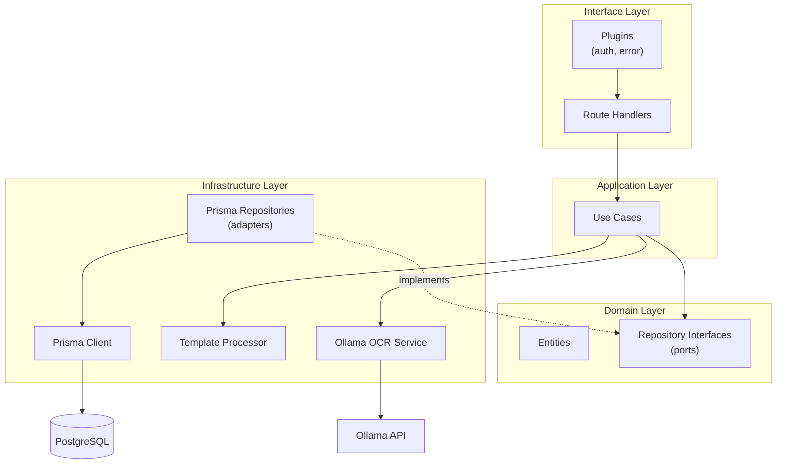
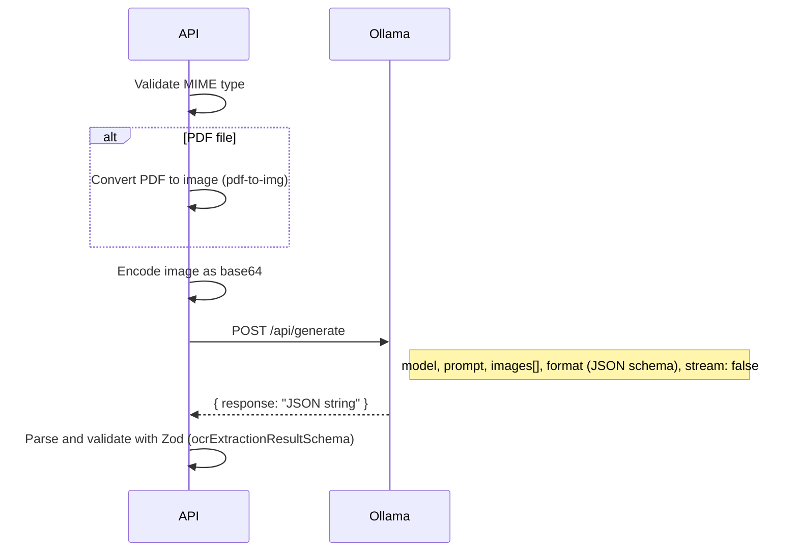
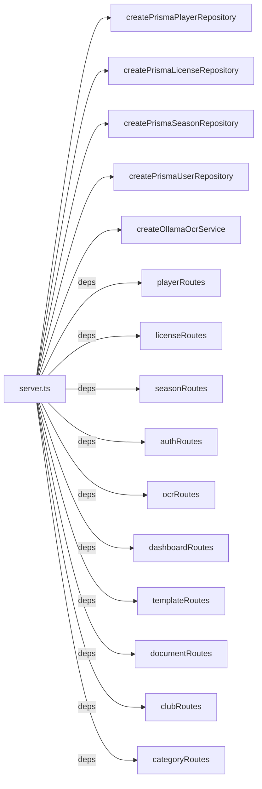

# API Architecture

The API is a **Fastify** REST server following **Domain-Driven Design (DDD)** principles. It lives in `apps/api/` and runs on port 3001.

## Folder structure

```
apps/api/
├── prisma/
│   ├── schema.prisma          # Database schema
│   ├── seed.ts                # Seed script (default club, admin, seasons)
│   └── migrations/            # Prisma migration files
├── src/
│   ├── config.ts              # Zod-validated environment config
│   ├── server.ts              # Fastify bootstrap and wiring
│   ├── domain/                # Business entities and repository interfaces
│   │   ├── license/
│   │   ├── player/
│   │   ├── season/
│   │   └── user/
│   ├── application/           # Use cases (business logic)
│   │   ├── auth/
│   │   ├── license/
│   │   ├── ocr/
│   │   ├── player/
│   │   └── template/
│   ├── infrastructure/        # External implementations
│   │   ├── ocr/
│   │   ├── prisma/
│   │   └── template/
│   └── interface/             # HTTP layer
│       ├── plugins/
│       └── routes/
├── Dockerfile                 # Multi-stage production build
├── package.json
└── tsconfig.json
```

## Architecture overview



### Data flow

A request travels through four layers:

1. **Interface** — the route handler receives the HTTP request, validates input with Zod, and calls a use case.
2. **Application** — the use case orchestrates business logic. It depends on repository interfaces (not concrete implementations).
3. **Domain** — entities define the shape of business objects. Repository interfaces define what operations are available (ports).
4. **Infrastructure** — concrete implementations of repositories (Prisma), external services (Ollama), and file processors (ExcelJS, docx-templates).

Dependencies flow inward: infrastructure implements domain interfaces, application depends on domain, interface depends on application. The domain layer has zero dependencies on outer layers.

## Server bootstrap (`server.ts`)

The `server.ts` file wires everything together:

1. Loads configuration from environment variables via `loadConfig()`.
2. Creates a Fastify instance with logging enabled.
3. Instantiates all repository implementations and services.
4. Registers Fastify plugins: CORS, JWT, auth, error handling, multipart uploads (5 MB limit).
5. Registers route groups under the `/api` prefix.

Auth routes (`/api/auth/*`) are registered without the `authenticate` pre-handler — they are public. All other routes are registered inside a group that adds `authenticate` as a pre-handler, requiring a valid JWT.

## Configuration (`config.ts`)

Environment variables are validated at startup using a Zod schema. If any required variable is missing, the server fails fast with a clear error.

| Config key | Env variable | Default | Description |
|---|---|---|---|
| `port` | `PORT` | `3001` | Server port |
| `host` | `HOST` | `0.0.0.0` | Server host |
| `databaseUrl` | `DATABASE_URL` | — (required) | PostgreSQL connection string |
| `jwtSecret` | `JWT_SECRET` | — (required) | JWT signing secret |
| `nodeEnv` | `NODE_ENV` | `development` | Environment |
| `corsOrigin` | `CORS_ORIGIN` | `http://localhost:3000` | Allowed CORS origin |
| `ollamaBaseUrl` | `OLLAMA_BASE_URL` | `http://localhost:11434` | Ollama server URL |
| `ollamaModel` | `OLLAMA_MODEL` | `gemma3` | Vision model name |

---

## Domain layer

The domain layer defines the core business entities and the interfaces (ports) for accessing them. It has no dependencies on frameworks, databases, or HTTP — pure TypeScript interfaces.

### Entities

Each entity is a readonly TypeScript interface that mirrors the database model shape.

#### PlayerEntity

Defined in `domain/player/playerEntity.ts`.

| Field | Type | Description |
|---|---|---|
| `id` | string | UUID |
| `clubId` | string | Owning club |
| `firstName` | string | First name |
| `lastName` | string | Last name |
| `birthDate` | Date | Date of birth |
| `gender` | Gender | G, F, H, or D |
| `address` | string | Home address |
| `phone` | string \| null | Phone number |
| `email` | string \| null | Email address |
| `photoUrl` | string \| null | Photo URL |
| `createdAt` | Date | Creation timestamp |
| `updatedAt` | Date | Last update timestamp |

Helper function: `getPlayerFullName(player)` returns `"lastName firstName"`.

#### LicenseEntity

Defined in `domain/license/licenseEntity.ts`.

| Field | Type | Description |
|---|---|---|
| `id` | string | UUID |
| `playerId` | string | Licensed player |
| `seasonId` | string | Season |
| `number` | string | Unique license number |
| `status` | LicenseStatus | active or expired |
| `category` | string | Category at creation time |
| `startDate` | Date | Validity start |
| `endDate` | Date | Validity end |
| `createdAt` | Date | Creation timestamp |
| `updatedAt` | Date | Last update timestamp |

Helper functions: `isLicenseActive(license)`, `isLicenseExpired(license)`.

#### SeasonEntity

Defined in `domain/season/seasonEntity.ts`.

| Field | Type | Description |
|---|---|---|
| `id` | string | UUID |
| `label` | string | Display label (e.g., "2025-2026") |
| `startDate` | Date | Season start |
| `endDate` | Date | Season end |
| `active` | boolean | Whether this season is the current active one |

#### UserEntity

Defined in `domain/user/userEntity.ts`.

| Field | Type | Description |
|---|---|---|
| `id` | string | UUID |
| `clubId` | string \| null | Associated club |
| `name` | string | Display name |
| `email` | string | Login email |
| `passwordHash` | string | bcrypt hash |
| `role` | Role | User role (adminClub) |
| `lastLogin` | Date \| null | Last login timestamp |
| `createdAt` | Date | Creation timestamp |

### Repository interfaces

Each entity has a corresponding repository interface that defines data access operations. These are the **ports** in the hexagonal architecture.

#### PlayerRepository

```
findById(id) → PlayerEntity | null
findMany(filters) → PlayerEntity[]
create(input) → PlayerEntity
update(id, input) → PlayerEntity
delete(id) → void
countByClub(clubId) → number
```

**PlayerFilters**: `clubId`, `search`, `gender`, `birthDateFrom`, `birthDateTo`, `seasonId`.

#### LicenseRepository

```
findById(id) → LicenseEntity | null
findMany(filters) → LicenseEntity[]
findManyWithRelations(filters) → LicenseWithRelations[]
findActiveByPlayerId(playerId) → LicenseEntity | null
create(input) → LicenseEntity
countBySeason(seasonId) → number
getNextSequenceNumber(seasonId) → number
```

**LicenseFilters**: `playerId`, `seasonId`, `status`, `category`, `number`, `startDateFrom`, `startDateTo`, `endDateFrom`, `endDateTo`.

#### SeasonRepository

```
findById(id) → SeasonEntity | null
findActive() → SeasonEntity | null
findAll() → SeasonEntity[]
create(input) → SeasonEntity
update(id, input) → SeasonEntity
delete(id) → void
deactivateAll() → void
```

#### UserRepository

```
findById(id) → UserEntity | null
findByEmail(email) → UserEntity | null
updateLastLogin(id) → void
```

---

## Application layer

The application layer contains **use cases** — functions that implement business logic by orchestrating domain repositories and infrastructure services. Each use case receives its dependencies via a `Deps` interface (dependency injection without a framework).

### Auth

#### `authenticateUser(deps, input)`

Verifies email/password credentials using bcrypt. If valid, updates the user's `lastLogin` and returns an `AuthResult` (userId, name, email, role, clubId). Throws `"Invalid credentials"` if the user is not found or the password doesn't match.

### Player

#### `createPlayer(deps, input)`

Creates a new player via the repository. Delegates entirely to `playerRepository.create()`.

#### `listPlayers(deps, filters)`

Returns a list of players matching the given filters. Delegates to `playerRepository.findMany()`.

#### `updatePlayer(deps, id, input)`

Checks that the player exists (throws `"Player not found"` if not), then updates via the repository.

#### `deletePlayer(deps, id)`

Checks that the player exists (throws `"Player not found"` if not), then deletes via the repository.

### License

#### `createLicense(deps, input)`

Validates that both the player and season exist before creating the license. Throws `"Player not found"` or `"Season not found"` on failure.

#### `createLicensesBatch(deps, inputs)`

Creates multiple licenses sequentially. Validates each player and season before creating. Stops at the first failure and throws.

#### `listLicenses(deps, filters)`

Returns licenses with player and season relations included (`findManyWithRelations`).

### OCR

#### `extractDocumentData(deps, clubId, fileBuffer, mimeType)`

1. Validates the MIME type (JPEG, PNG, WebP, PDF).
2. Calls the OCR service to extract structured data.
3. Stores the extraction in the database (original file + extracted data).
4. Returns the extraction ID and extracted data.

#### `validateExtraction(deps, extractionId, clubId, input)`

Updates an existing extraction with human-corrected data. Verifies the extraction exists and belongs to the right club.

### Template

#### `previewTemplate(fileBuffer, filename)`

Parses an XLSX file for preview display in the web UI. Only supports `.xlsx` files.

---

## Infrastructure layer

The infrastructure layer provides concrete implementations of domain interfaces and external service integrations.

### Prisma repositories

All four repositories follow the same pattern: a factory function (`createPrisma*Repository`) takes a `PrismaClient` instance and returns an object implementing the domain repository interface.

#### `prismaPlayerRepository`

Implements `PlayerRepository`. Notable behavior:
- **Search**: splits the search string into words, each word must match either `firstName` or `lastName` (case-insensitive).
- **Date filtering**: supports `birthDateFrom`/`birthDateTo` range queries.
- **Ordering**: players are returned sorted by `lastName` ascending.

#### `prismaLicenseRepository`

Implements `LicenseRepository`. Notable behavior:
- **Filter builder**: `buildLicenseWhere()` constructs Prisma `where` clauses from filter parameters.
- **Relations**: `findManyWithRelations()` includes player name and season label.
- **Number search**: case-insensitive `contains` on the license number.
- **Ordering**: licenses are returned sorted by `createdAt` descending.

#### `prismaSeasonRepository`

Implements `SeasonRepository`. Notable behavior:
- **Active season**: only one season can be active. `create()` and `update()` automatically deactivate all other seasons when `active: true`.
- **Ordering**: seasons are sorted by `label` descending.

#### `prismaUserRepository`

Implements `UserRepository`. Simple read-only operations plus `updateLastLogin`.

### Prisma client (`prismaClient.ts`)

Creates a singleton `PrismaClient`. In development, the client is cached on `globalThis` to survive hot reloads without creating multiple database connections.

### Ollama OCR service

Defined in `infrastructure/ocr/ollamaOcrService.ts`.



**Key details**:
- Supports JPEG, PNG, WebP, and PDF (PDF is converted to an image first using `pdf-to-img`).
- Sends a structured prompt instructing the model to extract player and license data.
- Uses Ollama's `format` parameter with a JSON schema to enforce structured output.
- The response is validated against `ocrExtractionResultSchema` from `@hoop/shared`.

**Error types**:
- `OcrConnectionError` — Ollama is unreachable (fetch throws). Returns HTTP 503.
- `OcrExtractionError` — Ollama returned an error or unexpected format. Returns HTTP 422.

### Template processor

Defined in `infrastructure/template/templateProcessor.ts`. Handles both XLSX and DOCX template processing.

#### XLSX processing (`processXlsxTemplate`)

1. Loads the XLSX file with ExcelJS.
2. Replaces document-level placeholders (`{{seasonLabel}}`, `{{clubName}}`, `{{clubSection}}`, `{{exportDate}}`).
3. Finds the first row containing player-level placeholders (e.g., `{{playerFirstName}}`).
4. Uses that row as a template: fills it with the first player's data, then inserts additional rows for remaining players.
5. Preserves cell styling (font, borders, alignment, fill) across generated rows.
6. Writes the result to a buffer.

#### DOCX processing (`processDocxTemplate`)

Uses the `docx-templates` library with `{{` / `}}` as delimiters. Passes a `players` array and document-level context. The library handles looping and placeholder replacement natively.

### XLSX placeholder writer

Defined in `infrastructure/template/xlsxPlaceholderWriter.ts`. Takes a buffer and a list of cell mappings, writes placeholder strings into the specified cells. Used during template upload when the user visually maps cells to placeholders.

### XLSX preview parser

Defined in `infrastructure/template/xlsxPreviewParser.ts`. Parses an XLSX file and returns a `SpreadsheetPreview` containing:
- All cells with their values, styles (bold, italic, font size, colors, borders, alignment), and detected placeholders.
- Merged cell regions.
- Column widths (converted from Excel units to pixels).
- Row and column counts.

---

## Interface layer

### Plugins

#### Auth plugin (`authPlugin.ts`)

Registers two things on the Fastify instance:
- A `jwtPayload` request decorator — holds the decoded JWT payload (`userId`, `role`, `clubId`).
- An `authenticate` function — verifies the JWT and populates `request.jwtPayload`. Throws `"Unauthorized"` on invalid tokens.

#### Error plugin (`errorPlugin.ts`)

A global error handler that translates errors into appropriate HTTP status codes:

| Error condition | HTTP status | Response body |
|---|---|---|
| `ZodError` | 400 | `{ error: "Validation Error", details: [...] }` |
| `"Invalid credentials"` | 401 | `{ error: "Invalid credentials" }` |
| `"Unauthorized"` | 401 | `{ error: "Unauthorized" }` |
| `"Forbidden"` | 403 | `{ error: "Forbidden" }` |
| Contains `"No club"` | 403 | `{ error: <message> }` |
| Contains `"not found"` | 404 | `{ error: <message> }` |
| Contains `"Unsupported file type"` | 400 | `{ error: <message> }` |
| Contains `"Cannot"` or `"can only"` | 400 | `{ error: <message> }` |
| Any other error | 500 | `{ error: "Internal Server Error" }` |

### Routes

All routes are registered under the `/api` prefix.

#### Auth routes

| Method | Path | Auth | Description |
|---|---|---|---|
| POST | `/api/auth/login` | No | Authenticate with email/password. Returns JWT token and user info. |
| GET | `/api/auth/me` | Yes | Returns the current user's JWT payload (userId, role, clubId). |

#### Club routes

| Method | Path | Auth | Description |
|---|---|---|---|
| GET | `/api/clubs/me` | Yes | Returns the current user's club. |

#### Category routes

| Method | Path | Auth | Description |
|---|---|---|---|
| GET | `/api/categories` | Yes | Lists all category configs for the user's club, ordered by `displayOrder`. |
| POST | `/api/categories` | Yes | Creates a new category config. Body: `{ name, minAge, maxAge, displayOrder }`. |
| PUT | `/api/categories/:id` | Yes | Updates a category config. Body: partial `{ name, minAge, maxAge, displayOrder }`. |
| DELETE | `/api/categories/:id` | Yes | Deletes a category config. Returns 204. |

#### Player routes

| Method | Path | Auth | Description |
|---|---|---|---|
| GET | `/api/players` | Yes | Lists players with filters: `search`, `gender`, `clubId`, `birthDateFrom`, `birthDateTo`, `category`, `seasonId`. When `category` is provided, players are filtered by computed category. |
| GET | `/api/players/:id` | Yes | Returns a single player by ID. |
| POST | `/api/players` | Yes | Creates a new player. Body validated with `createPlayerSchema`. |
| PUT | `/api/players/:id` | Yes | Updates a player. Body validated with `updatePlayerSchema`. |
| DELETE | `/api/players/:id` | Yes | Deletes a player. Returns 204. |
| GET | `/api/players/:id/licenses` | Yes | Lists all licenses for a player. |

**Category filtering**: when a `category` query parameter is provided, the route fetches all players, loads category configs for the club, resolves the season year (from `seasonId` or current year), and filters players by their computed category using `computeCategory()`.

#### License routes

| Method | Path | Auth | Description |
|---|---|---|---|
| GET | `/api/licenses` | Yes | Lists licenses with filters: `seasonId`, `status`, `category`, `number`, `startDateFrom`, `startDateTo`, `endDateFrom`, `endDateTo`. Returns licenses with player name and season label. |
| POST | `/api/licenses` | Yes | Creates a single license. Body validated with `createLicenseSchema`. |
| POST | `/api/licenses/batch` | Yes | Creates multiple licenses at once. Body validated with `createLicensesBatchSchema`. |

#### Season routes

| Method | Path | Auth | Description |
|---|---|---|---|
| GET | `/api/seasons` | Yes | Lists all seasons, ordered by label descending. |
| POST | `/api/seasons` | Yes | Creates a new season. Body validated with `createSeasonSchema`. If `active: true`, deactivates all other seasons first. |
| PUT | `/api/seasons/:id` | Yes | Updates a season. Body validated with `updateSeasonSchema`. If `active: true`, deactivates all others. |
| DELETE | `/api/seasons/:id` | Yes | Deletes a season. Returns 204. |

#### Dashboard routes

| Method | Path | Auth | Description |
|---|---|---|---|
| GET | `/api/dashboard/stats` | Yes | Returns dashboard statistics: `totalPlayers`, `activeLicenses`, `expiringLicenses`, `playersByCategory`. Uses the active season and category configs to compute player distribution. |

#### Template routes

| Method | Path | Auth | Description |
|---|---|---|---|
| GET | `/api/templates` | Yes | Lists all templates for the user's club (metadata only, no file data). |
| GET | `/api/templates/:id` | Yes | Returns template metadata by ID. |
| GET | `/api/templates/:id/download` | Yes | Downloads the template file with appropriate Content-Type and Content-Disposition headers. |
| POST | `/api/templates` | Yes | Uploads a new template. Multipart form with `file`, `name`, `description`, `cellMappings`. For XLSX with `cellMappings`, writes placeholders into cells before saving. For DOCX, scans for `{{...}}` placeholders in the text. |
| DELETE | `/api/templates/:id` | Yes | Deletes a template. Returns 204. |
| POST | `/api/templates/preview` | Yes | Uploads an XLSX file and returns a `SpreadsheetPreview` for the visual editor. |
| POST | `/api/templates/generate` | Yes | Generates a new XLSX template from a list of placeholder column names. Body: `{ name, description?, columns }`. |

#### Document routes

| Method | Path | Auth | Description |
|---|---|---|---|
| POST | `/api/documents/generate` | Yes | Generates a filled document from a template and player data. Body: `{ templateId, playerIds, seasonId }`. Returns the file as a download (XLSX or DOCX). Replaces all placeholders with actual player, club, and season data. |

#### OCR routes

| Method | Path | Auth | Description |
|---|---|---|---|
| POST | `/api/ocr/extract` | Yes | Uploads a document image (JPEG, PNG, WebP, PDF). Calls Ollama to extract player and license data. Returns structured extraction result with an `extractionId`. |
| PATCH | `/api/ocr/extractions/:id` | Yes | Validates an extraction by saving human-corrected data. Body validated with `validateExtractionSchema`. |

---

## Dependency injection

The API uses manual dependency injection — no DI container. Repository implementations and services are created in `server.ts` and passed to route handlers as a `deps` object.



This approach makes it easy to swap implementations (e.g., for testing) without changing business logic.

---

## Testing

Tests use **Vitest** and follow the pattern: mock the dependencies, test the use case in isolation.

| Test file | What it tests |
|---|---|
| `application/auth/authenticateUser.test.ts` | Login success, user not found, wrong password |
| `application/player/createPlayer.test.ts` | Player creation via repository |
| `application/player/updatePlayer.test.ts` | Player update, player not found |
| `application/player/deletePlayer.test.ts` | Player deletion, player not found |
| `application/license/createLicense.test.ts` | License creation, missing player/season |
| `application/license/createLicensesBatch.test.ts` | Batch creation, failure on missing player |
| `application/ocr/extractDocumentData.test.ts` | Extraction success, unsupported file type, PDF/PNG support |
| `application/ocr/validateExtraction.test.ts` | Validation update, not found, wrong club |
| `infrastructure/ocr/ollamaOcrService.test.ts` | OCR service: request format, connection error, extraction error, MIME type validation |
| `infrastructure/template/xlsxPlaceholderWriter.test.ts` | Placeholder writing, preservation, empty mappings, no worksheets |
| `infrastructure/template/xlsxPreviewParser.test.ts` | Cell parsing, placeholder detection, styles, column widths, merged cells, empty workbook |

---

## Dockerfile

The API uses a multi-stage Docker build:

1. **base** — Node.js 20 Alpine with pnpm 10.29 enabled via corepack.
2. **deps** — installs all dependencies with `--frozen-lockfile`.
3. **builder** — copies source, generates Prisma client, compiles TypeScript.
4. **runner** — copies compiled output, Prisma schema, and `node_modules`. On startup, runs `prisma migrate deploy` then starts the Node.js server.
