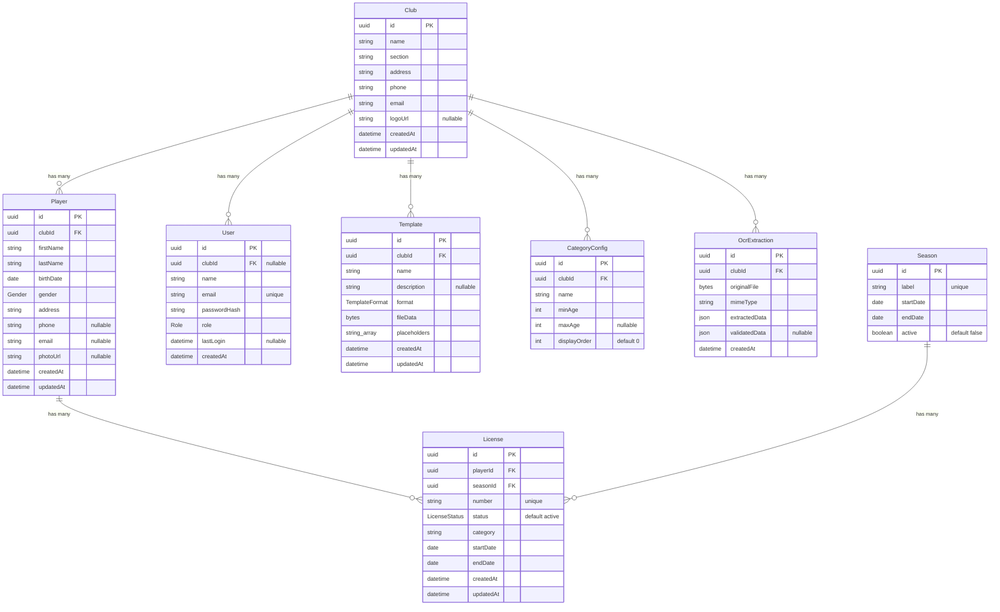

# Database Architecture

HoopAdmin uses **PostgreSQL 16** as its database, accessed through **Prisma 6** as ORM. The schema lives in `apps/api/prisma/schema.prisma`.

## Entity-Relationship diagram



## Models in detail

### Club

The top-level entity. Everything in HoopAdmin is scoped to a club. A club represents a basketball association (e.g., "BC Analamanga").

| Column | Type | Constraints | Description |
|---|---|---|---|
| `id` | UUID | PK, auto-generated | Unique identifier |
| `name` | String | required | Club name |
| `section` | String | required | Club section (e.g., "Basketball") |
| `address` | String | required | Physical address |
| `phone` | String | required | Contact phone number |
| `email` | String | required | Contact email |
| `logo_url` | String | nullable | URL to club logo |
| `created_at` | DateTime | auto-set | Creation timestamp |
| `updated_at` | DateTime | auto-updated | Last update timestamp |

**Relations**: has many Players, Users, Templates, CategoryConfigs, OcrExtractions.

**Table name**: `clubs`

### CategoryConfig

Age-based categories defined per club (e.g., U12, U14, U16, Senior). Used to automatically classify players based on their birth date relative to a season year.

| Column | Type | Constraints | Description |
|---|---|---|---|
| `id` | UUID | PK, auto-generated | Unique identifier |
| `club_id` | UUID | FK → Club | Owning club |
| `name` | String | required | Category name (e.g., "U14") |
| `min_age` | Int | required | Minimum age (inclusive) |
| `max_age` | Int | nullable | Maximum age (inclusive). Null means no upper bound (e.g., Senior) |
| `display_order` | Int | default 0 | Sort order for UI display |

**Relations**: belongs to Club.

**Table name**: `category_configs`

### Player

A person registered with the club. Players can hold multiple licenses across seasons.

| Column | Type | Constraints | Description |
|---|---|---|---|
| `id` | UUID | PK, auto-generated | Unique identifier |
| `club_id` | UUID | FK → Club | Owning club |
| `first_name` | String | required | First name |
| `last_name` | String | required | Last name |
| `birth_date` | Date | required | Date of birth (used for category computation) |
| `gender` | Gender | required | One of G, F, H, D |
| `address` | String | required | Home address |
| `phone` | String | nullable | Phone number |
| `email` | String | nullable | Email address |
| `photo_url` | String | nullable | URL to player photo |
| `created_at` | DateTime | auto-set | Creation timestamp |
| `updated_at` | DateTime | auto-updated | Last update timestamp |

**Relations**: belongs to Club, has many Licenses.

**Table name**: `players`

### License

A license ties a player to a season. Each license has a unique number and tracks its validity period.

| Column | Type | Constraints | Description |
|---|---|---|---|
| `id` | UUID | PK, auto-generated | Unique identifier |
| `player_id` | UUID | FK → Player | Licensed player |
| `season_id` | UUID | FK → Season | Season this license belongs to |
| `number` | String | unique | License number (e.g., "LIC-2025-001") |
| `status` | LicenseStatus | default `active` | Current status |
| `category` | String | required | Category at time of creation (e.g., "U14") |
| `start_date` | Date | required | License validity start |
| `end_date` | Date | required | License validity end |
| `created_at` | DateTime | auto-set | Creation timestamp |
| `updated_at` | DateTime | auto-updated | Last update timestamp |

**Relations**: belongs to Player, belongs to Season.

**Table name**: `licenses`

### User

An authenticated user of the application. Currently only the `adminClub` role exists. A user may optionally be associated with a club.

| Column | Type | Constraints | Description |
|---|---|---|---|
| `id` | UUID | PK, auto-generated | Unique identifier |
| `club_id` | UUID | FK → Club, nullable | Associated club (null if no club) |
| `name` | String | required | Display name |
| `email` | String | unique | Login email |
| `password_hash` | String | required | bcrypt-hashed password |
| `role` | Role | required | User role |
| `last_login` | DateTime | nullable | Last login timestamp |
| `created_at` | DateTime | auto-set | Creation timestamp |

**Relations**: belongs to Club (optional).

**Table name**: `users`

### Season

A time period (typically a sports year, e.g., "2025-2026"). Only one season can be active at a time. Seasons are used to group licenses and compute dashboard stats.

| Column | Type | Constraints | Description |
|---|---|---|---|
| `id` | UUID | PK, auto-generated | Unique identifier |
| `label` | String | unique | Display label (e.g., "2025-2026") |
| `start_date` | Date | required | Season start |
| `end_date` | Date | required | Season end |
| `active` | Boolean | default `false` | Whether this is the current active season |

**Relations**: has many Licenses.

**Table name**: `seasons`

### Template

An XLSX or DOCX file uploaded by the club, containing placeholders that get replaced with player/club/season data during document generation.

| Column | Type | Constraints | Description |
|---|---|---|---|
| `id` | UUID | PK, auto-generated | Unique identifier |
| `club_id` | UUID | FK → Club | Owning club |
| `name` | String | required | Template name |
| `description` | String | nullable | Optional description |
| `format` | TemplateFormat | required | Either `xlsx` or `docx` |
| `file_data` | Bytes | required | The template file content (binary) |
| `placeholders` | String[] | required | List of placeholder keys found in the file |
| `created_at` | DateTime | auto-set | Creation timestamp |
| `updated_at` | DateTime | auto-updated | Last update timestamp |

**Relations**: belongs to Club.

**Table name**: `templates`

### OcrExtraction

Stores the result of an OCR extraction. The original document image is kept alongside the AI-extracted data and the human-validated corrections.

| Column | Type | Constraints | Description |
|---|---|---|---|
| `id` | UUID | PK, auto-generated | Unique identifier |
| `club_id` | UUID | FK → Club | Owning club |
| `original_file` | Bytes | required | The uploaded document (image or PDF) |
| `mime_type` | String | required | File MIME type (image/jpeg, image/png, etc.) |
| `extracted_data` | JSON | required | AI-extracted structured data |
| `validated_data` | JSON | nullable | Human-corrected data (null until validated) |
| `created_at` | DateTime | auto-set | Creation timestamp |

**Relations**: belongs to Club.

**Table name**: `ocr_extractions`

## Enums

### Gender

Represents player gender categories used in basketball registration:

| Value | Meaning |
|---|---|
| `G` | Garçon (boy) |
| `F` | Fille (girl) |
| `H` | Homme (man) |
| `D` | Dame (woman) |

### LicenseStatus

| Value | Meaning |
|---|---|
| `active` | License is currently valid |
| `expired` | License has expired |

### Role

| Value | Meaning |
|---|---|
| `adminClub` | Club administrator — full access to their club's data |

### TemplateFormat

| Value | Meaning |
|---|---|
| `xlsx` | Microsoft Excel spreadsheet |
| `docx` | Microsoft Word document |

## Migrations

Migrations live in `apps/api/prisma/migrations/` and are managed by Prisma Migrate.

| Migration | Description |
|---|---|
| `20260228184201_initial` | Creates all initial tables: clubs, players, licenses, users, seasons, templates, category_configs |
| `20260228221035_add_ocr_extraction` | Adds the `ocr_extractions` table for the OCR import feature |

### Running migrations

```bash
# Development (creates migration files from schema changes)
pnpm db:migrate

# Production (applies pending migrations without generating new ones)
cd apps/api && pnpm exec prisma migrate deploy
```

## Column naming convention

Prisma models use camelCase (e.g., `firstName`). The `@map` directive maps them to snake_case in PostgreSQL (e.g., `first_name`). Table names are also mapped to plural snake_case via `@@map` (e.g., model `Player` → table `players`).

## Data scoping

All data queries are scoped by `clubId`. When a user logs in, their JWT contains their `clubId`. Every route handler extracts the `clubId` from the JWT and passes it to repository queries. This ensures that users can only see and modify data belonging to their club.
