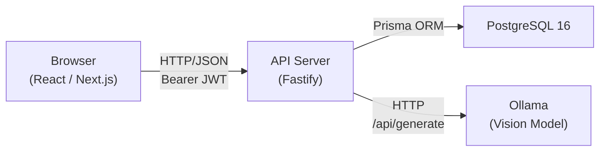
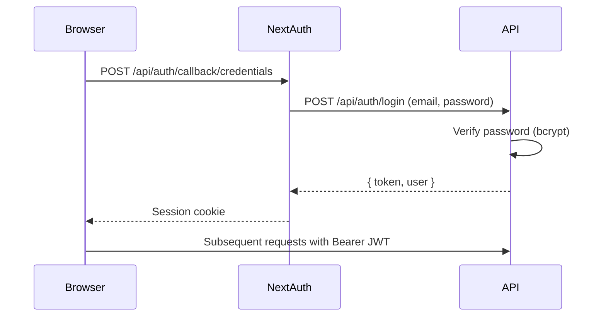
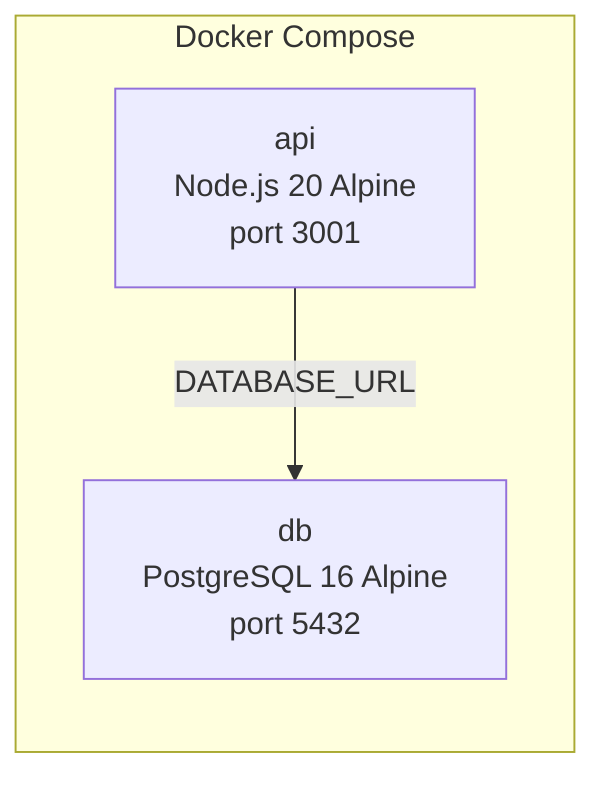

# HoopAdmin — Project Overview

HoopAdmin is a web application that helps local basketball clubs manage their players, licenses, seasons, and official documents. A club administrator logs in, registers players, assigns licenses per season, uploads document templates (XLSX or DOCX), and generates filled documents ready for federation submission. The app also includes an OCR feature that extracts player and license data from photos of official documents (birth certificates, ID cards, license cards).

## Who uses it

Club administrators (role `adminClub`). Each administrator belongs to one club. All data — players, licenses, templates — is scoped to that club.

## Monorepo structure

HoopAdmin is a **pnpm workspace monorepo** with three packages:

```
hoop/
├── apps/
│   ├── api/             # Backend — Fastify REST API
│   └── web/             # Frontend — Next.js web application
├── packages/
│   └── shared/          # Shared types, Zod schemas, constants, utilities
├── docs/
│   ├── architecture/    # This documentation
│   └── ollama-setup.md  # OCR/Ollama installation guide
├── .github/workflows/   # CI and deployment pipelines
├── docker-compose.yml       # Production: API + PostgreSQL
├── docker-compose.dev.yml   # Development: PostgreSQL only
├── tsconfig.base.json       # Shared TypeScript configuration
├── pnpm-workspace.yaml
└── package.json             # Root scripts
```

The three packages reference each other via pnpm workspace protocol. Both `@hoop/api` and `@hoop/web` import `@hoop/shared` as `workspace:*`.

## Technology stack

### Backend (`@hoop/api`)

| Technology | Version | Role |
|---|---|---|
| Node.js | 20 | Runtime |
| Fastify | 5.3 | HTTP framework |
| Prisma | 6.6 | ORM and database migrations |
| PostgreSQL | 16 | Database |
| Zod | 3.24 | Request/response validation |
| bcrypt | 6.0 | Password hashing |
| ExcelJS | 4.4 | XLSX reading, writing, template processing |
| docx-templates | 4.15 | DOCX template processing |
| pdf-to-img | 5.0 | PDF-to-image conversion for OCR |
| @fastify/jwt | 9.1 | JWT authentication |
| @fastify/multipart | 9.4 | File upload handling |
| @fastify/cors | 11.0 | Cross-origin resource sharing |

### Frontend (`@hoop/web`)

| Technology | Version | Role |
|---|---|---|
| Next.js | 15.3 | React framework (App Router) |
| React | 19.1 | UI library |
| NextAuth (Auth.js) | 5.0-beta | Authentication (Credentials provider) |
| Tailwind CSS | 3.4 | Utility-first styling |
| Lucide React | 0.511 | Icon library |
| class-variance-authority | 0.7 | Component variant management |
| clsx + tailwind-merge | — | Conditional class merging |
| Zod | 3.24 | Client-side validation |

### Shared (`@hoop/shared`)

| Technology | Version | Role |
|---|---|---|
| Zod | 3.24 | Validation schemas shared across API and web |
| TypeScript | 5.7 | Type definitions |

### Tooling

| Tool | Purpose |
|---|---|
| pnpm 10.29 | Package manager and workspace orchestration |
| TypeScript 5.7 | Type safety (strict mode, ES2022 target) |
| ESLint 9 | Linting |
| Prettier 3.5 | Code formatting |
| Vitest 3.1 | Unit testing (API, web, shared) |
| Docker Compose | Local database and production deployment |
| GitHub Actions | CI/CD pipelines |

## How the pieces connect



1. The **browser** talks to the **API** over HTTP. Every request (except login) carries a JWT token in the `Authorization` header.
2. The **API** reads and writes data in **PostgreSQL** through Prisma.
3. For OCR, the API sends document images to **Ollama** (a self-hosted vision model) and receives structured JSON back.

## Authentication flow



The frontend uses NextAuth with a Credentials provider. On login, NextAuth calls the API's `/api/auth/login` endpoint, which verifies the password with bcrypt and returns a JWT. NextAuth stores the token in the session. All subsequent API calls include `Authorization: Bearer <token>`.

## Root scripts

These scripts are run from the project root:

| Script | What it does |
|---|---|
| `pnpm dev` | Starts both API (port 3001) and web (port 3000) in development mode |
| `pnpm dev:api` | Starts only the API server with hot reload (tsx watch) |
| `pnpm dev:web` | Starts only the Next.js dev server |
| `pnpm build` | Builds both API (TypeScript compilation) and web (Next.js production build) |
| `pnpm lint` | Runs ESLint across all packages |
| `pnpm format` | Formats all `.ts`, `.tsx`, `.json`, `.md` files with Prettier |
| `pnpm format:check` | Checks formatting without writing |
| `pnpm test` | Runs all tests across all packages (Vitest) |
| `pnpm db:dev` | Starts a PostgreSQL container for development |
| `pnpm db:stop` | Stops the development PostgreSQL container |
| `pnpm db:migrate` | Runs Prisma migrations in development mode |
| `pnpm db:seed` | Seeds the database with default data (club, admin user, seasons) |

## Getting started

```bash
# 1. Clone and install
git clone <repo-url>
cd hoop
pnpm install

# 2. Configure environment
cp .env.example apps/api/.env
cp .env.example apps/web/.env.local
# Edit both files — see the environment variables table below

# 3. Start the database
pnpm db:dev

# 4. Run migrations and seed
cd apps/api
pnpm exec prisma migrate deploy
pnpm prisma:seed
cd ../..

# 5. Start development
pnpm dev
```

Default login credentials: `admin@bcanalamanga.mg` / `password123`

### Environment variables

| Variable | File | Default | Description |
|---|---|---|---|
| `DATABASE_URL` | `apps/api/.env` | — | PostgreSQL connection string |
| `JWT_SECRET` | `apps/api/.env` | — | Secret for signing JWT tokens |
| `PORT` | `apps/api/.env` | `3001` | API server port |
| `HOST` | `apps/api/.env` | `0.0.0.0` | API server host |
| `CORS_ORIGIN` | `apps/api/.env` | `http://localhost:3000` | Allowed CORS origin |
| `OLLAMA_BASE_URL` | `apps/api/.env` | `http://localhost:11434` | URL where Ollama is running |
| `OLLAMA_MODEL` | `apps/api/.env` | `gemma3` | Vision model for OCR extraction |
| `NEXT_PUBLIC_API_URL` | `apps/web/.env.local` | — | API URL for browser-side requests |
| `API_URL` | `apps/web/.env.local` | — | API URL for server-side requests |
| `NEXTAUTH_SECRET` | `apps/web/.env.local` | — | NextAuth session encryption secret |
| `NEXTAUTH_URL` | `apps/web/.env.local` | — | NextAuth callback URL |

## CI/CD

### CI pipeline (`ci.yml`)

Runs on every push and pull request to `main`:

1. **Lint** — checks formatting with `pnpm format:check`
2. **Test API** — spins up a PostgreSQL service, runs Prisma migrations, runs API tests
3. **Test Web** — runs web tests
4. **Build** — builds both API and web

### Deploy pipeline (`deploy.yml`)

Runs on push to `main` (skips if the commit message starts with `chore` or contains `[skip deploy]`):

1. Builds the Next.js web app
2. Deploys the API via SSH — pulls latest code, rebuilds Docker image, runs Prisma migrations
3. Uploads the web build (standalone + static files) to the VPS via SCP

## Docker

### Production (`docker-compose.yml`)

Runs the API and PostgreSQL together. The API image is built from a multi-stage Dockerfile that installs dependencies, generates the Prisma client, compiles TypeScript, and runs migrations on startup.



### Development (`docker-compose.dev.yml`)

Runs only PostgreSQL on port 5432. The API and web run locally with hot reload.

## Further reading

| Document | Description |
|---|---|
| [api.md](api.md) | API architecture — every layer, every route, every module |
| [web.md](web.md) | Web architecture — every page, every feature, every component |
| [shared.md](shared.md) | Shared package — all types, schemas, constants, utilities |
| [database.md](database.md) | Database schema — full ER diagram, all models, all relations |
| [../ollama-setup.md](../ollama-setup.md) | Ollama installation and OCR configuration guide |
