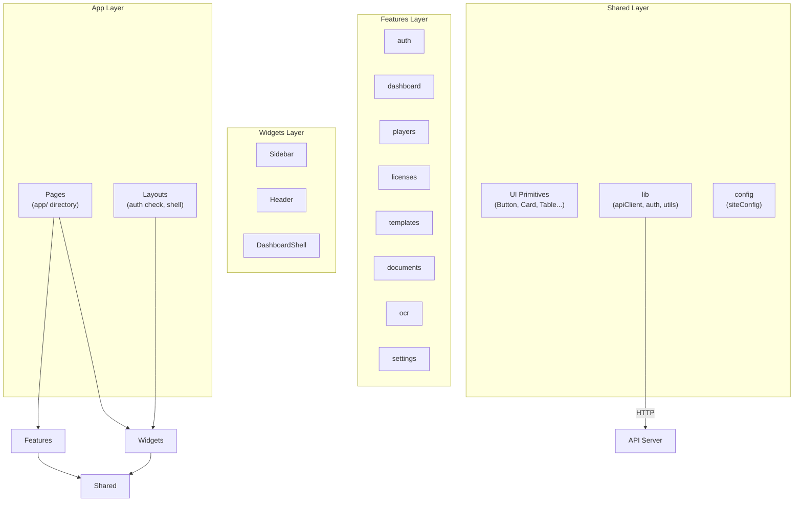
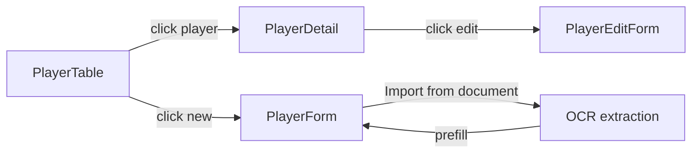
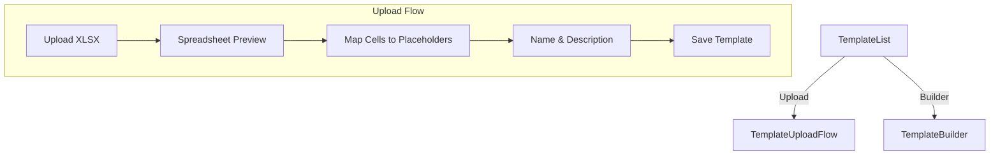
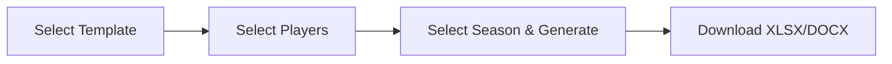
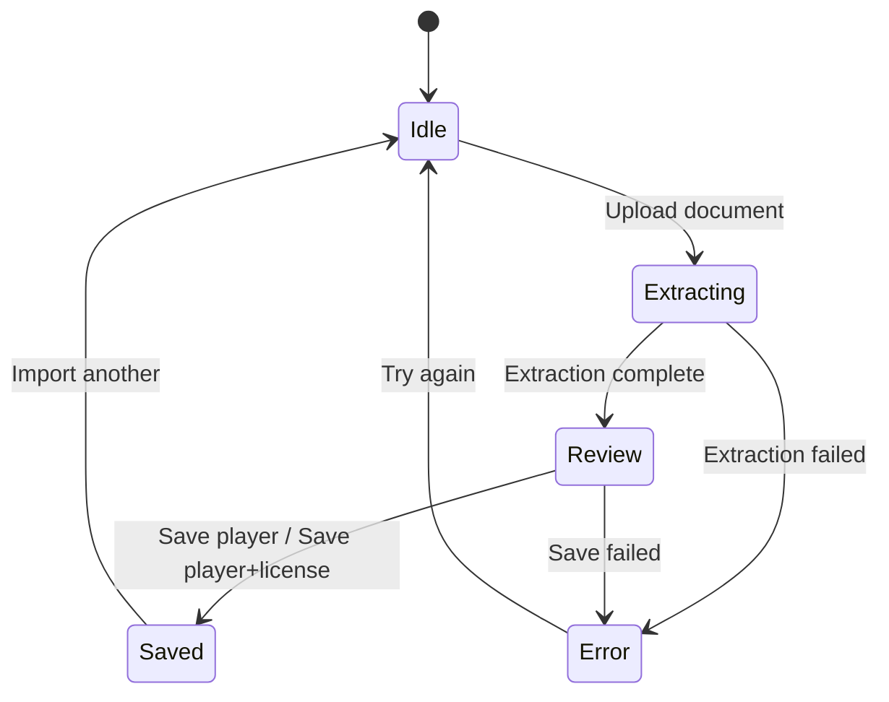

# Web Architecture

The web application is a **Next.js 15** (App Router) frontend built with **React 19** and **Tailwind CSS**. It follows **Feature-Sliced Design (FSD)**, an architectural pattern that organizes code by business feature rather than by technical role. It lives in `apps/web/` and runs on port 3000.

## Folder structure

```
apps/web/src/
├── app/                        # Next.js App Router — pages and layouts
│   ├── layout.tsx              # Root layout (font, metadata, providers)
│   ├── providers.tsx           # SessionProvider, ToastProvider, Toaster
│   ├── globals.css             # Tailwind base, CSS variables, animations
│   ├── api/auth/[...nextauth]/ # NextAuth API route handler
│   ├── (auth)/                 # Public routes (no auth required)
│   │   └── login/page.tsx      # Login page
│   └── (dashboard)/            # Protected routes (auth required)
│       ├── layout.tsx          # Auth check, redirect to /login, DashboardShell
│       ├── page.tsx            # Dashboard home
│       ├── players/            # Player pages
│       ├── licenses/           # License pages
│       ├── templates/          # Template pages
│       ├── documents/          # Document generation page
│       ├── import/             # OCR import page
│       └── settings/           # Settings page
├── features/                   # Business features (self-contained modules)
│   ├── auth/
│   ├── dashboard/
│   ├── documents/
│   ├── licenses/
│   ├── ocr/
│   ├── players/
│   ├── settings/
│   └── templates/
├── shared/                     # Reusable utilities, config, UI primitives
│   ├── config/
│   ├── lib/
│   └── ui/
└── widgets/                    # Layout-level components
    ├── header/
    ├── shell/
    └── sidebar/
```

## Architecture overview



### Feature-Sliced Design rules

- Each **feature** is a self-contained module with its own `api/` (API client functions) and `ui/` (React components) subdirectories.
- Features **never import from other features** directly. They communicate through the shared layer and page-level composition.
- The **shared** layer provides UI primitives, utilities, and configuration that any feature can use.
- **Widgets** are layout-level components (sidebar, header, shell) that compose features into the page layout.
- **Pages** (in `app/`) are thin wrappers that compose features and widgets together.

---

## Shared layer

### Configuration (`shared/config/siteConfig.ts`)

Defines the navigation structure used by the sidebar:

| Nav item | Path | Icon |
|---|---|---|
| Dashboard | `/` | LayoutDashboard |
| Players | `/players` | Users |
| Import | `/import` | ScanLine |
| Documents | `/documents` | FileText |
| Licenses | `/licenses` | Award |
| Templates | `/templates` | FileSpreadsheet |
| Settings | `/settings` | Settings |

### Library (`shared/lib/`)

#### `apiClient.ts`

A thin `fetch` wrapper that all API calls go through:
- Prepends the base URL from `NEXT_PUBLIC_API_URL`.
- Sets `Content-Type: application/json` and `Authorization: Bearer <token>`.
- Throws on non-OK responses with the error message from the API body.

#### `auth.ts`

NextAuth configuration with a Credentials provider:
- On sign-in, calls `POST /api/auth/login` on the API server using the server-side `API_URL`.
- Stores the JWT token, role, and clubId in the NextAuth JWT and session.
- Redirects unauthenticated users to `/login`.

#### `authTypes.ts`

Augments NextAuth's TypeScript types to include `role`, `clubId`, and `accessToken` on the `User` and `Session` objects.

#### `utils.ts`

Exports `cn()` — a helper that merges class names using `clsx` and `tailwind-merge`. Used throughout all components for conditional styling.

#### `formUtils.ts`

Exports `getFormString(formData, key)` — extracts a string value from FormData.

### UI primitives (`shared/ui/`)

Reusable, headless-style components built with Tailwind CSS and `class-variance-authority`:

| Component | File | Description |
|---|---|---|
| **Button** | `button.tsx` | Variants: `default`, `destructive`, `outline`, `secondary`, `ghost`, `link`. Sizes: `default`, `sm`, `lg`, `icon`. |
| **Input** | `input.tsx` | Styled text input with focus ring. |
| **Label** | `label.tsx` | Form label with consistent styling. |
| **Select** | `select.tsx` | Native select element with styling. |
| **SearchableSelect** | `searchable-select.tsx` | Select with search/filter functionality. Dropdown with search input, scrollable options list. |
| **Card** | `card.tsx` | Card container with `CardHeader`, `CardTitle`, `CardDescription`, `CardContent` sub-components. |
| **Badge** | `badge.tsx` | Inline badge with variants: `default`, `secondary`, `destructive`, `outline`, `success`, `warning`. |
| **Table** | `table.tsx` | Table with `TableHeader`, `TableBody`, `TableRow`, `TableHead`, `TableCell` sub-components. |
| **Skeleton** | `skeleton.tsx` | Loading placeholder. Also exports `TableSkeleton` for table loading states. |
| **Toast** | `toast.tsx` | Toast notification system with `ToastProvider`, `useToast` hook, and `Toaster` component. Uses `createPortal` for rendering. |
| **ConfirmDialog** | `confirm-dialog.tsx` | Modal confirmation dialog with title, description, confirm/cancel buttons, and loading state. |
| **Breadcrumbs** | `breadcrumbs.tsx` | Breadcrumb navigation with clickable links and current page indicator. |
| **FilterBar** | `filter-bar.tsx` | Generic filter bar driven by `FilterFieldDefinition` from `@hoop/shared`. Renders appropriate inputs (text, select, date) based on field type. |
| **PlayerFilterBar** | `player-filter-bar.tsx` | Player-specific filter bar with search, gender, category, and date range filters. |

---

## Widgets layer

### DashboardShell (`widgets/shell/DashboardShell.tsx`)

The main layout wrapper for all dashboard pages:
- Renders the **Sidebar** on desktop (fixed, left side).
- Renders the **Header** with a mobile menu button.
- On mobile, the sidebar appears as a full-screen overlay triggered by the header menu button.
- Main content area with responsive padding.

### Sidebar (`widgets/sidebar/Sidebar.tsx`)

Navigation sidebar:
- Renders the app logo/title at the top.
- Lists all nav items from `siteConfig`.
- Highlights the active route.
- Includes a "Sign out" button at the bottom with a confirmation dialog.

### Header (`widgets/header/Header.tsx`)

Top header bar:
- Mobile menu toggle button (hamburger icon).
- Displays the current user's name, role, and an avatar letter.

---

## Features layer

Each feature follows the same structure: `api/` for API client functions and `ui/` for React components.

### Auth feature

#### API: none (uses NextAuth directly)

#### UI

| Component | Description |
|---|---|
| **LoginForm** | Email and password form. Calls `signIn("credentials", ...)` from NextAuth. Shows toast on error, redirects to `/` on success. |

---

### Dashboard feature

#### API (`dashboard/api/dashboardApi.ts`)

| Function | Description |
|---|---|
| `fetchDashboardStats(token)` | Returns `{ totalPlayers, activeLicenses, expiringLicenses, playersByCategory }` |

#### UI

| Component | Description |
|---|---|
| **StatsCards** | Displays four stat cards: total players, active licenses, expiring licenses, and a breakdown by category. Links to relevant pages. |

---

### Players feature

#### API (`players/api/playerApi.ts`)

| Function | Description |
|---|---|
| `fetchPlayers(token, filters?)` | Lists players with optional filters (search, gender, category, dates, seasonId) |
| `fetchPlayer(token, id)` | Gets a single player by ID |
| `fetchPlayerLicenses(token, id)` | Gets all licenses for a player |
| `createPlayer(token, data)` | Creates a new player |
| `updatePlayer(token, id, data)` | Updates a player |
| `deletePlayer(token, id)` | Deletes a player |

#### UI

| Component | Description |
|---|---|
| **PlayerTable** | Main players list. Includes `PlayerFilterBar` for filtering. Displays players in a table (desktop) or cards (mobile). Each row has view/edit/delete actions. Delete shows a confirmation dialog. |
| **PlayerForm** | Form for creating a new player. Includes a "Import from document" button that triggers OCR extraction — extracted data is used to pre-fill the form fields. Fields: firstName, lastName, birthDate, gender, address, phone, email. |
| **PlayerDetail** | Displays a player's full information in a card, plus a table of their licenses. Includes edit and delete buttons. |
| **PlayerEditForm** | Form for editing an existing player. Pre-filled with current values. Includes breadcrumbs for navigation. |



---

### Licenses feature

#### API (`licenses/api/licenseApi.ts`)

| Function | Description |
|---|---|
| `fetchLicenses(token, filters?)` | Lists licenses with optional filters |
| `fetchPlayerLicenses(token, playerId)` | Lists licenses for a specific player |
| `createLicense(token, data)` | Creates a single license |
| `createLicensesBatch(token, data)` | Creates multiple licenses at once |

#### UI

| Component | Description |
|---|---|
| **LicenseTable** | Main licenses list with filter bar (season, status, category, number, date ranges). Displays licenses with player name and season label. |
| **LicenseForm** | Form for creating a single license. Fields: playerId (searchable select), seasonId (select), number, status, category, startDate, endDate. |
| **LicenseBatchForm** | Form for creating multiple licenses at once. Shared season and date fields, with multiple player/category/number rows. |

The license creation page lets the user toggle between single and batch mode.

---

### Templates feature

#### API (`templates/api/templateApi.ts`)

| Function | Description |
|---|---|
| `fetchTemplates(token)` | Lists all templates for the club |
| `deleteTemplate(token, id)` | Deletes a template |
| `previewTemplate(token, file)` | Uploads an XLSX file and returns a spreadsheet preview |
| `uploadTemplate(token, data)` | Uploads a template with file, name, description, and cell mappings |
| `generateTemplate(token, data)` | Generates a template from selected placeholder columns |
| `downloadTemplate(token, id)` | Downloads a template file |

#### UI

| Component | Description |
|---|---|
| **TemplateList** | Table of templates with name, format, placeholder count, dates. Actions: download, delete. |
| **TemplateUploadFlow** | Multi-step upload wizard: (1) upload XLSX file → (2) preview spreadsheet → (3) visually map cells to placeholders → (4) enter name/description → (5) save. |
| **TemplateUploadForm** | Simple file upload form for XLSX/DOCX files. |
| **TemplateBuilder** | Alternative to upload: select placeholder columns from a checkbox list, reorder them, give the template a name, and generate an XLSX from scratch. |
| **TemplateMetadataForm** | Name and description inputs used in the upload flow. |
| **SpreadsheetGrid** | Renders the XLSX preview as a visual grid. Handles merged cells, cell selection, and placeholder badges. |
| **SpreadsheetCell** | Individual cell in the spreadsheet grid. Renders value, applies styling (bold, italic, font size, colors, borders, alignment), shows placeholder badge. |
| **PlaceholderDropdown** | Floating dropdown that appears when you click a cell. Lists all available placeholders, lets you pick one to assign to that cell. |
| **PlaceholderSidebar** | Sidebar showing all current cell-to-placeholder mappings. Lets you remove mappings. |



---

### Documents feature

#### API (`documents/api/documentApi.ts`)

| Function | Description |
|---|---|
| `generateDocument(token, data)` | Generates a document from a template, player list, and season. Downloads the resulting XLSX file. |

#### UI

| Component | Description |
|---|---|
| **DocumentGenerator** | Three-step wizard: (1) select a template → (2) select players (with search and filter) → (3) select a season and generate. Downloads the resulting file. Uses `SearchableSelect` for season picking and checkboxes for player selection. |



---

### OCR (Import) feature

#### API (`ocr/api/ocrApi.ts`)

| Function | Description |
|---|---|
| `extractDocument(token, file)` | Uploads a document image to the API for OCR extraction. Returns structured player and license data. |
| `saveValidatedData(token, extractionId, input)` | Saves human-validated extraction data. |

#### UI

| Component | Description |
|---|---|
| **ImportFlow** | Orchestrates the OCR import process. States: idle → extracting → review → saved/error. On save, can either create just a player or a player with a license. |
| **DocumentDropzone** | Drag-and-drop zone for uploading documents. Accepts JPEG, PNG, WebP, PDF (5 MB max). Shows upload instructions and file type icons. |
| **ExtractionReview** | Displays extracted data in editable fields. Shows confidence level. Two save options: "Save Player" (creates player only) or "Save Player + License" (creates both). Fields are pre-filled from OCR results and editable by the user. |



---

### Settings feature

#### API

| File | Function | Description |
|---|---|---|
| `settingsApi.ts` | `fetchMyClub(token)` | Returns the current user's club info |
| `seasonApi.ts` | `fetchSeasons(token)` | Lists all seasons |
| `seasonApi.ts` | `createSeason(token, data)` | Creates a new season |
| `seasonApi.ts` | `updateSeason(token, id, data)` | Updates a season |
| `seasonApi.ts` | `deleteSeason(token, id)` | Deletes a season |
| `categoryApi.ts` | `fetchCategories(token)` | Lists category configs for the club |

#### UI

| Component | Description |
|---|---|
| **SeasonManager** | Full CRUD interface for seasons. Inline add/edit forms. Toggle active status (only one can be active). Delete with confirmation. |

The settings page also displays the club's information (name, section, address, phone, email) in a read-only card.

---

## Pages

Each page in `app/(dashboard)/` is a thin wrapper that imports feature components and passes them any needed parameters (like route params).

| Route | Page component | Feature components used |
|---|---|---|
| `/` | Dashboard | `StatsCards` |
| `/players` | Players list | `PlayerTable` |
| `/players/new` | New player | `PlayerForm`, `Breadcrumbs` |
| `/players/[id]` | Player detail | `PlayerDetail` |
| `/players/[id]/edit` | Edit player | `PlayerEditForm` |
| `/licenses` | Licenses list | `LicenseTable` |
| `/licenses/new` | New license | `LicenseForm`, `LicenseBatchForm` |
| `/templates` | Templates list | `TemplateList` |
| `/templates/upload` | Template upload | `TemplateUploadFlow` |
| `/templates/builder` | Template builder | `TemplateBuilder` |
| `/documents` | Document generation | `DocumentGenerator` |
| `/import` | OCR import | `ImportFlow` |
| `/settings` | Settings | `SeasonManager`, club info card |

## Authentication and route protection

The `(dashboard)/layout.tsx` checks for an active NextAuth session. If the user is not authenticated, they are redirected to `/login`. Once authenticated, the layout renders the `DashboardShell` (sidebar + header + main content area).

The session's `accessToken` (JWT) is passed to all API client functions so they can include it in the `Authorization` header.
